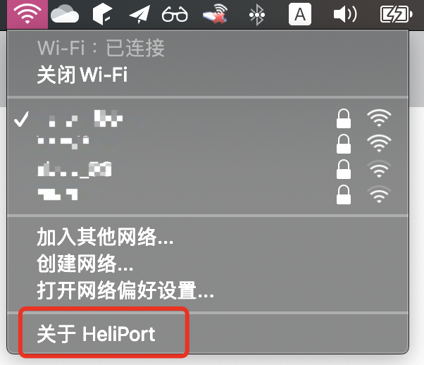

# 我的配置 !!

- 完美驱动Macos系统版本：macOS Catalina 10.15.3 （一定要用这个版本，否则会出现不经意的卡顿）
- 机型：Thinkpad隐士X1
- CPU：2.2 GHz 六核Intel Core i7
- 内存：40 GB 2667 MHz DDR4
- 硬盘：原装500g硬盘，三星981序列。不支持安装黑苹果
- 自加装硬盘：三星980 1t硬盘，拆了两个分区，用来装黑苹果。
- 显卡：Intel UHD Graphics 630 (Mobile) 2048 MB 驱动的主板的集成显示。（尝试驱动过独显，最终发现笔记本的独显目前没有完美的驱动的方案
- 对应EFI：Release/Thinkpad-X1E-GEN1-OpenCore-v1.0.5.7z

# 使用说明
http://app.myzaker.com/news/article.php?pk=615731088e9f09719328f53a&f=normal

# Notice !!!

The maintenance of clover version EFI is discontinued, and the future will focus on OpenCore EFI.

Intel WiFi Card can work normally!!!

[Go and see `itlwm`](https://github.com/OpenIntelWireless/itlwm)

[WiFi driver front-end application `HeliPort`](https://github.com/OpenIntelWireless/HeliPort)

Many thanks to hardware WiFi card driver developer [@zxystd](https://github.com/zxystd)!

Look at below:




## [Goto 中文说明](./readme-zh.md)

## update log

- [20-7-7] OpenCore EFI is done!
- [20-7-5] add opencore efi. (beta version!!)
- [20-7-5] use virualsmc replace fakesmc.
- [20-7-5] hotfix for bettery and keyboard function. (removed dsdt.aml)
- [20-6-23] intel bluetooth supported.
- [19-5-29] add noTouchId.kext. MacOS is expecting Touch ID to be available, causing lag on password prompts, this kext can fix this.

## OpenCore EFI Supported

- Touchpad & touch screen multi touch.
- Red dot PS2 control.
- Cpu power management use xcpm & hwp.
- Screen brightness adjustment and keyboard button control.
- Battery level information.
- AppleALC for sound card.
- card reader support.
- Machine sleep and wakeup.
- Intel bluetooth supported. (Thanks for @zxystd!)
- intel cable Gigabit LAN. (mini RJ45)
- intel integrated graphics.

## OpenCore EFI not Supported

- HDMI video output (more info see below `HDMI`)

## Opencore efi version considerations

You need to generate SMBIOS yourself([GenSMBIOS](https://github.com/corpnewt/GenSMBIOS)),reference for specific steps: [coffee-lake-8th-gen](https://khronokernel.github.io/Opencore-Vanilla-Laptop-Guide/config.plist/coffee-lake-8th-gen.html#Platforminfo)

## ACPI file description

- SSDT-Battery.aml  Battery level information hotfix.
- SSDT-keyboard.aml Screen brightness adjustment button repair on keyboard.
- SSDT_NVMe-Pcc.aml This is used to shield the PM981 on the main hard drive location. **If your PM981 is not the primary hard drive location, please do not use it**.
- SSDT-dGPUT-Off.aml Blocks discrete graphics and saves power.
- SSDT-GPRW.aml & SSDT-PTSWAK.aml Hibernation issue fix.
- SSDT-USBX.aml USB power injection.
- SSDT-PNLF-CFL.aml Screen brightness adjustment fix hot patch. 
- SSDT-PLUG.aml Cpu power management use xcpm+hwp.
- SSDT-HPET.aml Use SSDTTime to fix IRQ Conflicts from Clover like FixIPIC, FixTMR, FixRTC, FixHPET, etc. This patch requires the config.plist ACPI rename patch to cooperate.
- SSDT-SBUS-mchc.aml Fixing AppleSMBus support in macOS. 
- SSDT-PMC.aml This SSDT is required for all "true" 300 series motherboards(Z370 is excluded), it specifically brings back NVRAM support and requires very little configuration for the end user. 10th gen motherboards do not need this SSDT, NVRAM's native on these platforms.  **!! Maybe not needed**
- SSDT-RHUB.aml So on 400 series motherboards, certain OEMs have broken the ACPI spec and this results in issues when booting into macOS. To fix this, we'll want to turn off the RHUB device and force macOS to manually rebuild the ports. **!! Maybe not needed**


## Use intel original card Bluetooth

By default, the USB port of the Bluetooth original card is blocked. If you need to use the original Intel network card, modify config.plist yourself to remove the shield of `HS14`.

```xml
<dict>
	<key>boot-args</key>
	<string>keepsyms=1 debug=0x100 -wegnoegpu -cdfon -igfxmlr igfxfw=2 uia_exclude=HS05,HS06,USR1,USR2
      </string>
</dict>
```

## HDMI

- HDMI video output (requires usb 3.0 external graphics card supporting displaylink chip, the solution comes from [@Errrneist](https://github.com/Errrneist/Hackintosh-Thinkpad-X1-Extreme))

## Wireless network card perfect custom plan

[board design detail](https://github.com/zysuper/Thinkpad-X1-extreme-EFI/blob/master/doc/Wi-Fi%20bluethooth.md)

## Old Clover EFI

[clover readme](./clover.md)


